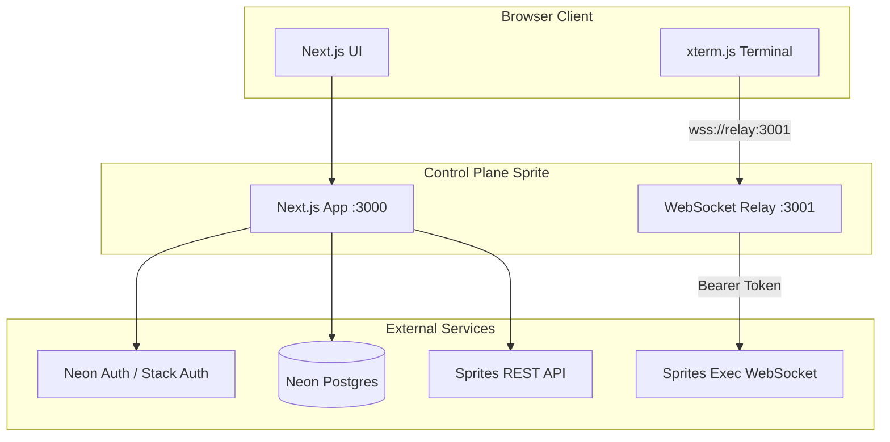
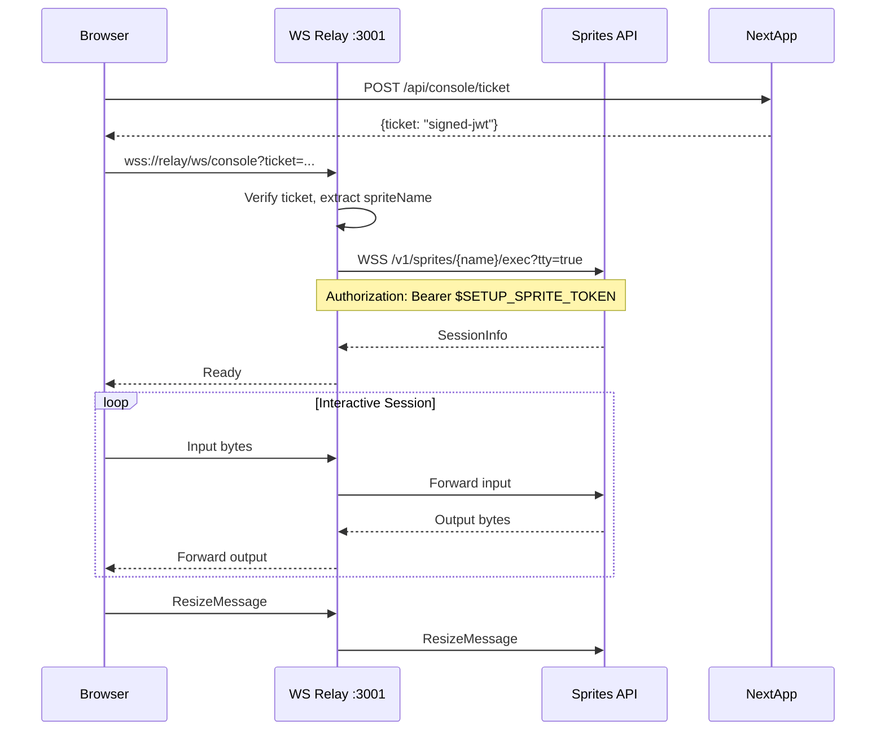

# Sprite Manager Implementation Plan

## Architecture Overview



---

## 1. Project Setup and Dependencies

### New Dependencies to Install

```bash
# Neon Auth (Stack Auth SDK)
pnpm add @stackframe/stack

# Database
pnpm add @neondatabase/serverless

# WebSocket relay server
pnpm add ws

# Terminal UI
pnpm add @xterm/xterm @xterm/addon-fit

# Dev dependencies
pnpm add -D @types/ws
```

### Environment Variables

Create [`.env.local`](.env.local):

```
# Neon Auth (from Neon Console after enabling Auth)
NEXT_PUBLIC_STACK_PROJECT_ID=...
NEXT_PUBLIC_STACK_PUBLISHABLE_CLIENT_KEY=...
STACK_SECRET_SERVER_KEY=...

# Neon Postgres
DATABASE_URL=...

# Sprites API
SETUP_SPRITE_TOKEN=...
SPRITES_ORG=matt-a-w-he-him

# WebSocket Relay
WS_RELAY_PORT=3001
WS_TICKET_SECRET=... # For signing short-lived tickets
```

---

## 2. Neon Auth Setup

### Initialize Stack Auth

Run the scaffolding command to create auth files:

```bash
npx @stackframe/init-stack@latest --no-browser
```

This creates:

- `stack/server.tsx` - Server-side auth utilities
- `stack/client.tsx` - Client-side hooks
- `app/handler/[...stack]/page.tsx` - Auth routes (sign-in, sign-up, etc.)
- Updates `app/layout.tsx` with `StackProvider`

### Configure GitHub OAuth Provider

1. Create GitHub OAuth App at github.com/settings/developers
2. Set callback URL to `https://<sprite-name>.sprites.app/handler/oauth/github`
3. Configure credentials in Neon Console: Project > Auth > OAuth Providers > GitHub

### Route Protection Pattern

```tsx
// In any protected page (Server Component)
import { stackServerApp } from '@/stack/server';
import { redirect } from 'next/navigation';

export default async function ProtectedPage() {
  const user = await stackServerApp.getUser();
  if (!user) redirect('/handler/sign-in');
  // ...
}
```

---

## 3. Database Schema

Create a new Neon project and set up the following tables. The `neon_auth` schema is managed by Neon Auth for users/sessions.

### Tables

```sql
-- Projects table
CREATE TABLE projects (
  id UUID PRIMARY KEY DEFAULT gen_random_uuid(),
  owner_user_id TEXT NOT NULL,  -- References neon_auth.users.id
  name TEXT NOT NULL,
  repo_url TEXT,
  default_branch TEXT DEFAULT 'main',
  created_at TIMESTAMPTZ DEFAULT now(),
  updated_at TIMESTAMPTZ DEFAULT now()
);

-- Sprites table
CREATE TABLE sprites (
  id UUID PRIMARY KEY DEFAULT gen_random_uuid(),
  project_id UUID REFERENCES projects(id) ON DELETE CASCADE,
  sprite_name TEXT NOT NULL UNIQUE,
  org TEXT NOT NULL,
  status TEXT DEFAULT 'cold',
  url TEXT,
  created_at TIMESTAMPTZ DEFAULT now()
);

-- Checkpoints cache (optional, for UI display)
CREATE TABLE checkpoints (
  id UUID PRIMARY KEY DEFAULT gen_random_uuid(),
  sprite_name TEXT NOT NULL,
  checkpoint_id TEXT NOT NULL,
  label TEXT,  -- e.g., 'clean', 'dev-ready'
  created_at TIMESTAMPTZ DEFAULT now(),
  UNIQUE(sprite_name, checkpoint_id)
);

-- Indexes
CREATE INDEX idx_projects_owner ON projects(owner_user_id);
CREATE INDEX idx_sprites_project ON sprites(project_id);
```

---

## 4. Sprites API Client

Create a server-side client for the Sprites REST API.

### File: [`lib/sprites-client.ts`](lib/sprites-client.ts)

Key functions:

- `createSprite(name: string, urlAuth?: 'sprite' | 'public')` - POST /v1/sprites
- `listSprites()` - GET /v1/sprites
- `getSprite(name: string)` - GET /v1/sprites/{name}
- `deleteSprite(name: string)` - DELETE /v1/sprites/{name}
- `createCheckpoint(spriteName: string, comment?: string)` - POST /v1/sprites/{name}/checkpoint
- `listCheckpoints(spriteName: string)` - GET /v1/sprites/{name}/checkpoints
- `restoreCheckpoint(spriteName: string, checkpointId: string)` - POST /v1/sprites/{name}/checkpoints/{id}/restore
- `execCommand(spriteName: string, cmd: string[])` - POST /v1/sprites/{name}/exec (non-interactive)

All functions use `Authorization: Bearer ${process.env.SETUP_SPRITE_TOKEN}`.

---

## 5. API Routes

### File Structure

```
app/api/
  projects/
    route.ts              # GET (list), POST (create)
    [id]/
      route.ts            # GET, PATCH, DELETE
      sprites/
        route.ts          # POST (create sprite for project)
  sprites/
    [name]/
      route.ts            # GET sprite details
      init/
        route.ts          # POST - run init script
      checkpoints/
        route.ts          # GET (list), POST (create "clean")
        [id]/
          restore/
            route.ts      # POST - restore checkpoint
  console/
    ticket/
      route.ts            # POST - mint WebSocket ticket
```

### Key Routes

| Endpoint | Method | Purpose |

| -------------------------------------------- | ------ | ------------------------------------- |

| `/api/projects` | POST | Create project (repo URL, name) |

| `/api/projects/:id/sprites` | POST | Create new sprite for project |

| `/api/sprites/:name/init` | POST | Install toolchain, clone repo |

| `/api/sprites/:name/checkpoints` | POST | Create checkpoint (label: "clean") |

| `/api/sprites/:name/checkpoints/:id/restore` | POST | Restore to checkpoint |

| `/api/console/ticket` | POST | Mint short-lived ticket for WebSocket |

---

## 6. WebSocket Relay Server

A separate Node.js process that bridges browser WebSocket connections to Sprites exec WebSocket.

### File: [`server/ws-relay.ts`](server/ws-relay.ts)



### Ticket Format

```json
{
  "spriteName": "my-sprite",
  "sessionId": "optional-existing-session",
  "cols": 80,
  "rows": 24,
  "exp": 1234567890
}
```

### Startup

Add to [`package.json`](package.json):

```json
{
  "scripts": {
    "dev": "next dev",
    "dev:relay": "tsx watch server/ws-relay.ts",
    "dev:all": "concurrently \"pnpm dev\" \"pnpm dev:relay\"",
    "start": "next start",
    "start:relay": "node dist/ws-relay.js"
  }
}
```

---

## 7. Terminal UI Component

### File: [`components/terminal.tsx`](components/terminal.tsx)

Client-only component using xterm.js with:

- FitAddon for auto-resize
- WebSocket connection to relay server
- Mobile key bar (Esc, Tab, Ctrl, Alt, arrows)
- Reconnection handling on resize

### Mobile Key Bar

```tsx
const MOBILE_KEYS = [
  { label: 'Esc', code: '\x1b' },
  { label: 'Tab', code: '\t' },
  { label: 'Ctrl', modifier: true },
  { label: 'Alt', modifier: true },
  { label: 'Up', code: '\x1b[A' },
  { label: 'Down', code: '\x1b[B' },
  { label: 'Left', code: '\x1b[D' },
  { label: 'Right', code: '\x1b[C' },
];
```

### Resize Handling

On viewport change (mobile keyboard, orientation):

1. Detect new dimensions via ResizeObserver
2. Calculate new cols/rows from container size
3. Send `{"type": "resize", "cols": N, "rows": M}` to WebSocket
4. Call `fitAddon.fit()`

---

## 8. UI Pages

### Page Structure

```
app/
  page.tsx                    # Landing / redirect to dashboard
  handler/
    [...stack]/
      page.tsx                # Auth pages (auto-generated)
  app/
    layout.tsx                # Protected layout with nav
    page.tsx                  # Dashboard - list projects
    projects/
      new/
        page.tsx              # New project form
      [id]/
        page.tsx              # Project detail - list sprites
        sprites/
          new/
            page.tsx          # Create sprite form
    sprites/
      [name]/
        page.tsx              # Sprite detail + actions
        terminal/
          page.tsx            # Full-screen terminal
```

### Key UI Components

| Component | Purpose |

| ---------------- | -------------------------------------------- |

| `ProjectList` | Display user's projects with create button |

| `ProjectCard` | Project summary with sprite count |

| `SpriteList` | Sprites for a project with status indicators |

| `SpriteActions` | Buttons: Open Terminal, Start Clean, Delete |

| `Terminal` | xterm.js terminal with mobile key bar |

| `NewProjectForm` | Name + repo URL input |

| `NewSpriteForm` | Sprite name + optional init options |

---

## 9. Deployment Configuration

### Next.js Config Update

```ts
// next.config.ts
const nextConfig: NextConfig = {
  output: 'standalone',
  experimental: {
    serverActions: {
      bodySizeLimit: '2mb',
    },
  },
};
```

### Running in the Sprite

The control-plane sprite runs both processes:

1. `next start` on port 3000
2. WebSocket relay on port 3001

Sprites automatically proxy ports, so both are accessible via the sprite URL.

---

## 10. File Summary

| File | Purpose |

| ------------------------------ | ---------------------------------- |

| `stack/server.tsx` | Server-side auth (generated) |

| `stack/client.tsx` | Client-side auth hooks (generated) |

| `lib/db.ts` | Neon database client |

| `lib/sprites-client.ts` | Sprites API wrapper |

| `lib/ticket.ts` | JWT ticket signing/verification |

| `server/ws-relay.ts` | WebSocket relay server |

| `components/terminal.tsx` | xterm.js terminal component |

| `components/mobile-keybar.tsx` | Touch-friendly special keys |

| `app/api/**` | API routes |

| `app/app/**` | Protected UI pages |
